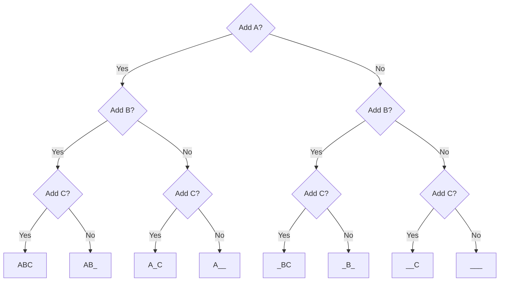

# Encoding Information

Passing messages by signalling over distance goes as far as to the ancient
times. One of the oldest examples is the signal towers of the Great Wall of
China. In 400 BC, signals could be sent by beacon fires or drum beats. By 200 BC
complex flag signalling had developed, and by the Han dynasty (200 BC–220 AD)
signallers had a choice of lights, flags, or gunshots to send signals.

At the core of all of those signals was a **coding** strategy -- some set of
rules that both sides agreed upon in order to communicate. But the idea of
encoding *meaning* and sending it as a **signal** was realized even earlier --
probably since the first controlled use of fire many of years ago.

[
    name: Semaphores & signal fires
    start: 4
](youtube://WrNDeYjcCJA)

It has been observed long ago that it is possible to represent two
[tag.essential:states](https://en.wikipedia.org/wiki/State_(computer_science))
using only a **single difference**.
However, the limitation of early means of sending signals were obvious -- the
[tag:state space](https://en.wikipedia.org/wiki/State_space) was severily
limited and in the case of a signal fire it could convey only two messages.

The need to convey more messages has lead to the invention of many different
ways of **encoding** messages into more differences.

## Polybius square

[tag:Polybius](https://en.wikipedia.org/wiki/Polybius#Cryptography) was a Greek
historian born in 200 BC who made famous a device called
[tag:Polybius square](https://en.wikipedia.org/wiki/Polybius_square)
that allowed to encode letters of an alphabet using symbols (originally groups
of torches) for transferring the message over distance.
This can be considered one of the first **encodings** ever used to transmit a
messages.

|       |   1   |   2   |   3   |   4   |   5   |
| :---: | :---: | :---: | :---: | :---: | :---: |
|   1   |   A   |   B   |   Γ   |   Δ   |   E   |
|   2   |   Z   |   H   |   Θ   |   I   |   K   |
|   3   |   Λ   |   M   |   N   |   Ξ   |   O   |
|   4   |   Π   |   P   |   Σ   |   T   |   Y   |
|   5   |   Φ   |   X   |   Ψ   |   Ω   |       |

    <a href="https://en.wikipedia.org/wiki/Polybius_square" target="_blank">
        Polybius square
    </a>

Usage of Polybius square in order to encode letters of an alphabet into symbols
for transmission marked the first use of
[tag:telegraphy](https://en.wikipedia.org/wiki/Telegraphy).
The **idea** that the Polybius square introduced was that it is possible to come
up with symbols that are able to convey an arbitrary number of differences
(i.e. number of torches) and then **combining** several of such symbols to form
a **message**.

More importantly, it showed that the **combination** of such symbols gives
ability to send **exponentially** more messages. In the case of Polybius square
-- `two` symbols where each symbol is a group of `five` torches made it possible
to transmit `5 x 5 = 25` messages.

## Binary Encoding

The word `binary` refers to the number of **differences** each symbol can have
in such encoding. A code built using these symbols can be thought of as a number
of `yes` or `no` questions. For instance, in order to encode a text message that
can consist of either letters `A`, `B` or `C` or any combinations of those, one
can come up with such
[tag:decision tree](https://en.wikipedia.org/wiki/Decision_tree)
that shows all possible combinations of yes/no questions:

> Given $n$ yes/no questions there are $2^n$ possible answers.
>
> In the example there are $3$ yes/no questions, hence there are $2^3 = 8$
> answers.

## Bacon's Cipher

Francis Bacon came up with a way to convey all letters of the alphabet using
a **single** difference with his bi-literal cipher:

> "The transposition of two letters by five placings will be sufficient for 32
> differences. For by this art, a way is opened whereby a man may express and
> signify the intentions of his mind -- at any distance of place -- with objects
> which are capable of a two-fold difference only."
>
> -- [Francis Bacon](https://en.wikipedia.org/wiki/Francis_Bacon)

|           |           |           |             |           |           |
| :-------: | :-------: | :-------: | :---------: | :-------: | :-------: |
|     A     |     B     |     C     |      D      |     E     |     F     |
|   aaaaa   |  aaaa*b*  |  aaa*b*a  |   aaa*bb*   |  aa*b*aa  | aa*b*a*b* |
|     G     |     H     |   I, J    |      K      |     L     |     M     |
|  aa*bb*a  |  aa*bbb*  |  a*b*aaa  |  a*b*aa*b*  | a*b*a*b*a | a*b*a*bb* |
|     N     |     O     |     P     |      Q      |     R     |     S     |
|  a*bb*aa  | a*bb*a*b* |  a*bbb*a  |   a*bbbb*   |  *b*aaaa  | *b*aaa*b* |
|     T     |   U, V    |     W     |      X      |     Y     |     Z     |
| *b*aa*b*a | *b*aa*bb* | *b*a*b*aa | *b*a*b*a*b* | *b*a*bb*a | *b*a*bbb* |

    <a href="https://en.wikipedia.org/wiki/Bacon%27s_cipher" target="_blank">
        Bi-Literal Cipher
    </a>

The way his cipher works is that he assigned a **unique** sequence of
*symbols* to each letter. The symbols that he used were letters `a` and `b`,
however it did not really matter what *signs* were used as long as it was
possible to distinguish them.

## Optical Telegraph

<!-- With the invention of telescope it became possible to transfer messages over
great distances using [tag:semaphores](https://en.wikipedia.org/wiki/Semaphore)
-- devices for the creation of visual signals. -->

[tag:Shutter telegraph](https://en.wikipedia.org/wiki/Optical_telegraph#Sweden)
used the idea of binary encoding to send messages using movable panels that
could be rotated to block or pass the light from the sky behind to convey
information. Here a single shutter panel can be considered a single difference.
Having as few as 6 shutters allowed to transmit up to $2^6 = 64$ differences,
more than enough for all letters and numbers.

<!-- ### Chappe's Semaphore

The next development of this idea was seen in the usage of a
[tag:Semaphore](https://en.wikipedia.org/wiki/Semaphore)
-- a device to create a signal that can be transmitted (often times visually).
A series of such devices allowed to transfer messages across great distances and
were called
[tag:optical telegraphs](https://en.wikipedia.org/wiki/Optical_telegraph).

[tag:Claude Chappe](https://en.wikipedia.org/wiki/Claude_Chappe)
was a French inventor who in 1792 demonstrated a practical semaphore system that
eventually spanned all of France[^2].

> Chappe coined the phrase `semaphore`, from
> the Greek meaning: `sêma`, "sign" + `phorós`, "carrying".

 -->

## Morse Code

With the invention of
[tag:electrical telegraphs](https://en.wikipedia.org/wiki/Electrical_telegraph)
in 1840s came the need for new codes. One of such codes is the famous
[tag:Morse code](https://en.wikipedia.org/wiki/Morse_code).

It uses **differences in time** in order to transmit letters encoded into binary
symbols -- either a `dash` or a `dot`. To separate dashes and dots for different
letters a concept of
[short and long gaps](https://en.wikipedia.org/wiki/Morse_code#Representation,_timing,_and_speeds)
is used.

|            |           |           |            |            |           |
| :--------: | :-------: | :-------: | :--------: | :--------: | :-------: |
|     A      |     B     |     C     |     D      |     E      |     F     |
|    · --    | -- · · ·  | -- · -- · |   -- · ·   |     ·      | · · -- ·  |
|     G      |     H     |     I     |     J      |     K      |     L     |
|  -- -- ·   |  · · · ·  |    · ·    | · -- -- -- |  -- · --   | · -- · ·  |
|     M      |     N     |     O     |     P      |     Q      |     R     |
|   -- --    |   -- ·    | -- -- --  | · -- -- ·  | -- -- · -- |  · -- ·   |
|     S      |     T     |     U     |     V      |     W      |     X     |
|   · · ·    |    --     |  · · --   |  · · · --  |  · -- --   | -- · · -- |
|     Y      |     Z     |           |            |            |           |
| -- · -- -- | -- -- · · |

    <a href="https://en.wikipedia.org/wiki/Morse_code#International_Morse_Code" target="_blank">
        International Morse Code
    </a>

    <iframe src="//commons.wikimedia.org/wiki/File:A_through_Z_in_Morse_code.ogg?embedplayer=yes" style="margin-bottom: 0" width="220" height="80" frameborder="0"></iframe>

    <a href="https://en.wikipedia.org/wiki/File:A_through_Z_in_Morse_code.ogg" target="_blank">
        Letters of English alphabet in Morse Code
    </a>

> **Learn More**:
> Watch an episode about [tag.image/youtube:Morse code](https://www.youtube.com/watch?v=xcjgm6ctzAw&list=PLbg3ZX2pWlgKDVFNwn9B63UhYJVIerzHL)
> from Art of the Problem.

#### References

[^1]: Wikipedia. [_Code_](https://en.wikipedia.org/wiki/Code)

[^Video 1]: Art of the Problem. _Information Theory part 4: Semaphores & signal fires_
[tag.image/youtube:Open Playlist](https://www.youtube.com/playlist?list=PLbg3ZX2pWlgKDVFNwn9B63UhYJVIerzHL)
